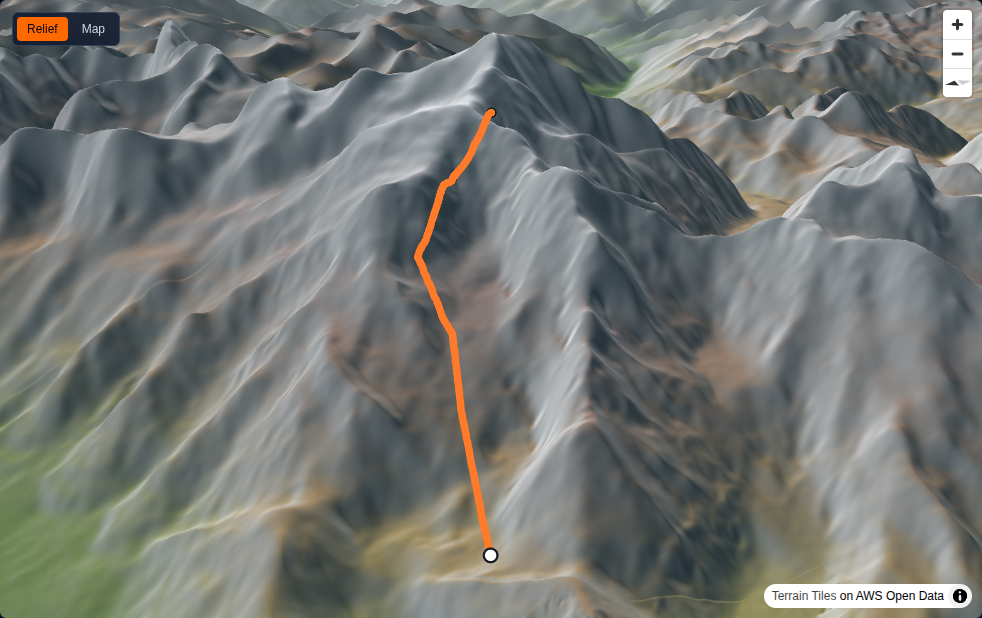

# MountainMadness

Log mountain trips and see your routes drawn on the real mountain, in 3D.



Next.js 16 · MapLibre GL JS terrain · deck.gl · PostGIS-ready

---

## Run it

No cloud credentials, no API keys, no database:

```bash
npm install
npx tsx scripts/seed.ts   # builds a demo track from real terrain (needs network)
npm run dev               # http://localhost:3000
```

The seed walks the real Goûter route waypoints on Mont Blanc, samples the actual
DEM for elevation, and runs the result through the same ingest pipeline an
upload uses. Then open the trip and orbit the mountain.

Uploading your own GPX at `/trips/new` works the same way.

## What it does

- **Ingest** — GPX in, cleaned and analysed out: null-island and GPS-teleport
  rejection, median-filtered elevation, hysteresis-banded ascent, moving time,
  windowed max grade, Douglas–Peucker simplification to a fixed point budget,
  and a distance-even elevation profile.
- **Terrain sampling** — the DEM is sampled along the track at ingest, so the
  drawn route can be lifted clear of a coarse mesh instead of sinking into it.
- **3D viewer** — MapLibre terrain with a hypsometric + hillshade skin, a
  screen-width route ribbon with a draped drop shadow, and a camera that frames
  the route from its low end so you look *at* the face.
- **Privacy trimming** — applied server-side at ingest, before geometry is
  stored, so a trimmed section never reaches any client.

## Scripts

| Command | Purpose |
| --- | --- |
| `npm run dev` | Dev server |
| `npm run build` | Production build |
| `npm test` | Unit tests (77) |
| `npm run typecheck` | `tsc --noEmit` |
| `npx tsx scripts/seed.ts` | Rebuild the demo peak, route and track |
| `LIVE_TERRAIN=1 npm test` | Also run the network tests against real DEM tiles |

## Configuration

Everything is optional; defaults run locally with no setup. See `.env.example`.

| Variable | Effect |
| --- | --- |
| `NEXT_PUBLIC_TERRAIN_SOURCE` | `proxy` (default), `aws`, `maptiler`, `custom` |
| `TERRAIN_UPSTREAM` | What `/api/dem` fetches from. Defaults to `aws`. |
| `DATABASE_URL` | Reserved for the Postgres store (**not yet implemented** — see below) |
| `BLOB_READ_WRITE_TOKEN` | Vercel Blob. Unset stores uploads under `.data/blob/` |

Terrain sources live in one file, `src/lib/tiles/sources.ts`. Swapping vendors
is a one-file change, by design — tile costs scale with engagement and you will
want to move.

## Layout

```
src/lib/geo/       parsing, cleaning, stats, simplification, DEM sampling
src/lib/store/     storage seam: Store interface + local JSON implementation
src/lib/tiles/     terrain source registry — the only place tile hosts appear
src/components/viewer/   the 3D viewer (client-only, lazily imported)
src/app/api/dem/   DEM tile proxy: edge-cacheable, keeps vendor keys server-side
drizzle/           hand-authored PostGIS DDL
docs/PLAN.md       the architecture plan this was built from
docs/IMPLEMENTATION-NOTES.md   where building it proved the plan wrong
```

## Known limitations

Read `docs/IMPLEMENTATION-NOTES.md` for the evidence behind each of these.

- **No depth occlusion.** Route sections behind a ridge draw on top of it
  instead of disappearing. deck.gl's interleaved mode — the usual fix — creates
  the layers but never gets them to screen while MapLibre terrain is on
  (measured: 0 route pixels interleaved vs ~3,800 in overlay mode). This is
  Phase 2's ship gate and it is not met.
- **`maplibre-gl` is pinned to v5.** v6 breaks both its bundled worker and
  deck.gl 9.3's interleaved mode.
- **No database.** `Store` is implemented only by a JSON-file store for local
  development. `getStore()` throws if `DATABASE_URL` is set rather than
  silently writing production data to an ephemeral serverless filesystem.
- **No auth.** Every upload is attributed to one seeded demo user.
- **Uploads capped at 4.5 MB**, the Vercel function body limit. The Blob
  client-upload handshake that lifts this is designed but not built.
- **A ~30 m DEM under-reads sharp summits** by up to ~200 m (Matterhorn:
  4,254 m vs 4,478 m surveyed). Inherent to the data, not a bug.
